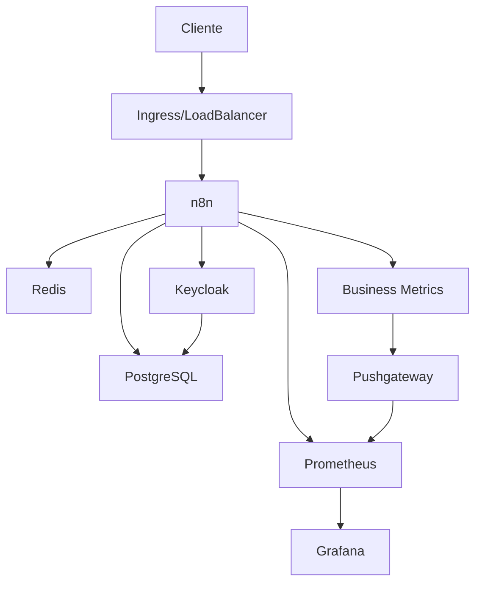

# Guia de Administração - n8n Enterprise

## Visão Geral
Este guia fornece instruções detalhadas para administradores do ambiente n8n Enterprise.

## Arquitetura


## Componentes Principais

### n8n
- Versão: latest
- Porta: 5678
- Healthcheck: http://localhost:5678/healthz
- Logs: `docker-compose logs n8n`

### PostgreSQL
- Versão: 13-alpine
- Porta: 5432
- Backup: Diário às 2h
- Monitoramento: Métricas no Prometheus

### Redis
- Versão: 6-alpine
- Configuração: /kubernetes/base/redis.conf
- Persistência: Habilitada
- Monitoramento: Métricas no Prometheus

### Keycloak
- Versão: latest
- Porta: 8080
- Realm: n8n
- Configuração: /kubernetes/base/keycloak-deployment.yaml

## Manutenção

### Backups
1. Verificação diária:
```bash
docker-compose logs backup
```

2. Restauração:
```bash
./scripts/restore.sh <data>
```

3. Teste de backup:
```bash
./scripts/test-backup.sh
```

### Atualizações
1. Pull das novas imagens:
```bash
docker-compose pull
```

2. Atualização com zero downtime:
```bash
docker-compose up -d --no-deps --scale n8n=2 n8n
```

3. Rollback se necessário:
```bash
docker-compose up -d --no-deps n8n:previous
```

### Monitoramento

#### Métricas Principais
- CPU/Memória por serviço
- Latência de requisições
- Taxa de erros
- Execuções de workflows
- Métricas de negócio

#### Alertas
1. Configuração no Grafana:
   - Thresholds
   - Canais de notificação
   - Escalação

2. Resposta a Incidentes:
   - Protocolo de investigação
   - Runbooks
   - Contatos de emergência

## Segurança

### Acesso
- RBAC via Keycloak
- 2FA obrigatório
- Rotação de secrets
- Audit logs

### Compliance
- GDPR/LGPD
- Logs retidos por 90 dias
- Backups criptografados
- Dados sensíveis mascarados

## Troubleshooting

### Problemas Comuns

1. n8n não inicia:
```bash
docker-compose logs n8n
# Verificar conexão com PostgreSQL
# Verificar permissões
```

2. Keycloak não conecta:
```bash
docker-compose logs keycloak
# Verificar banco de dados
# Verificar realm
```

3. Métricas não aparecem:
```bash
docker-compose logs prometheus pushgateway
# Verificar endpoints
# Verificar configuração
```

### Logs

1. Coleta centralizada:
```bash
docker-compose logs -f
```

2. Logs específicos:
```bash
docker-compose logs <serviço>
```

3. Debug mode:
```bash
N8N_LOG_LEVEL=debug docker-compose up -d n8n
```

## Otimização

### Performance
1. Cache Redis:
   - Configuração otimizada
   - Monitoramento de hit rate
   - Limpeza periódica

2. PostgreSQL:
   - Índices otimizados
   - Vacuum automático
   - Connection pooling

3. n8n:
   - Workflow batching
   - Concurrent executions
   - Resource limits

## Referências
- [Documentação Oficial n8n](https://docs.n8n.io/)
- [Keycloak Admin Guide](https://www.keycloak.org/docs/latest/server_admin/)
- [Prometheus Best Practices](https://prometheus.io/docs/practices/naming/)
- [Grafana Documentation](https://grafana.com/docs/) 