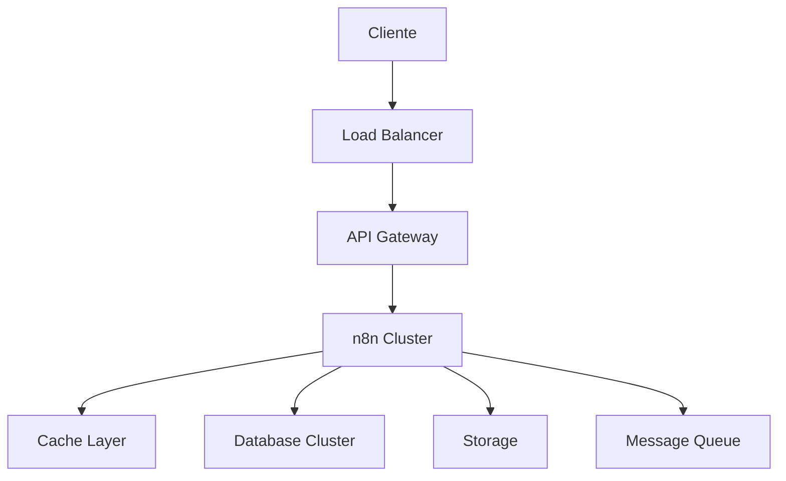
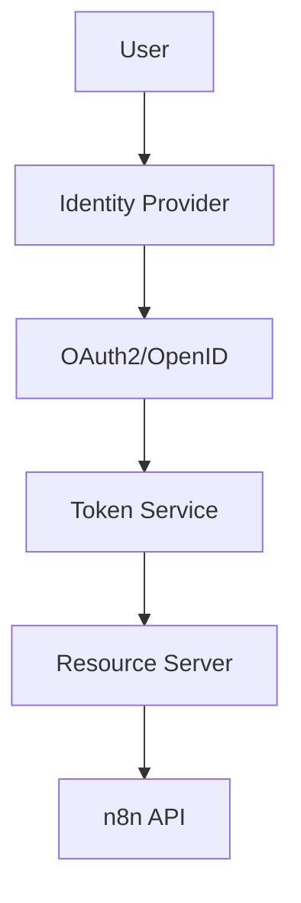
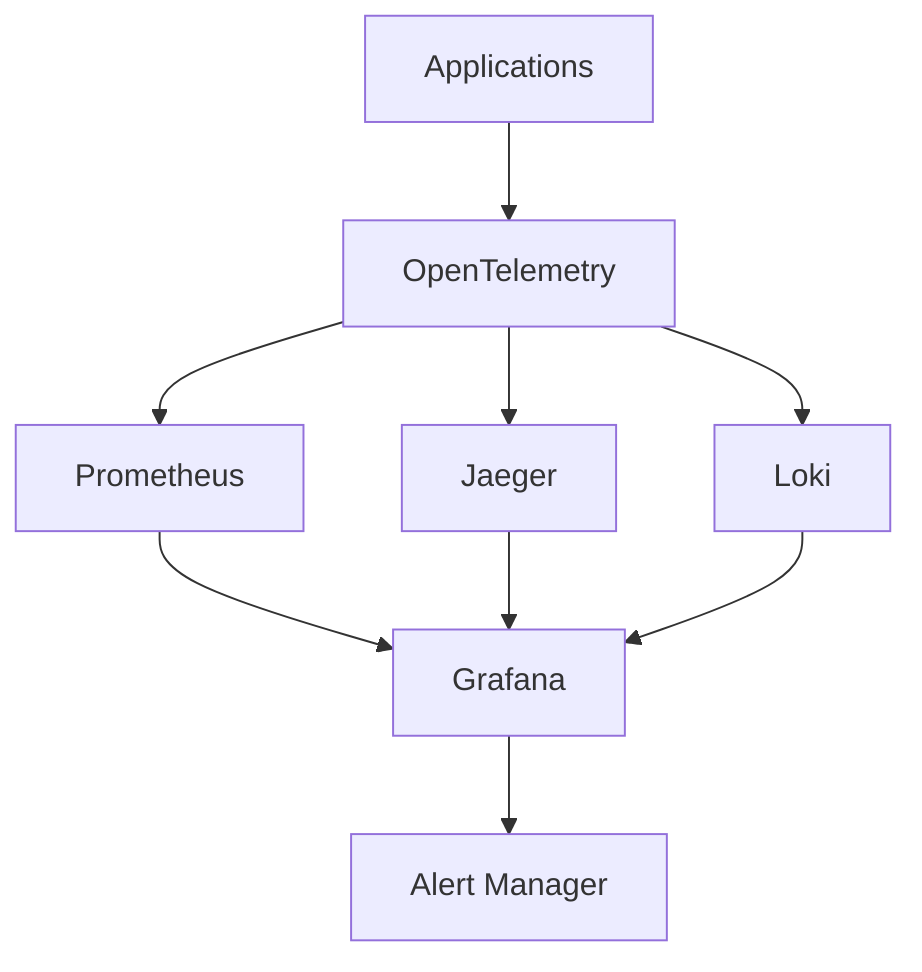
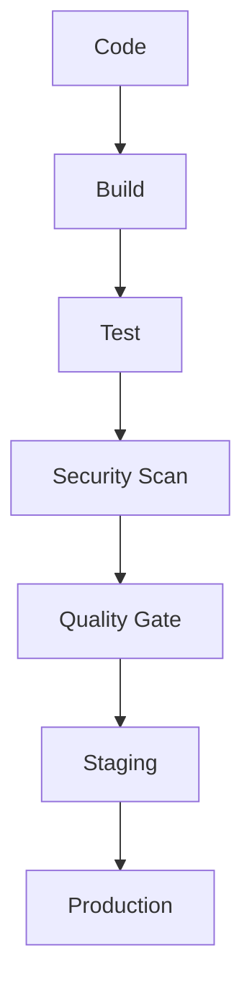
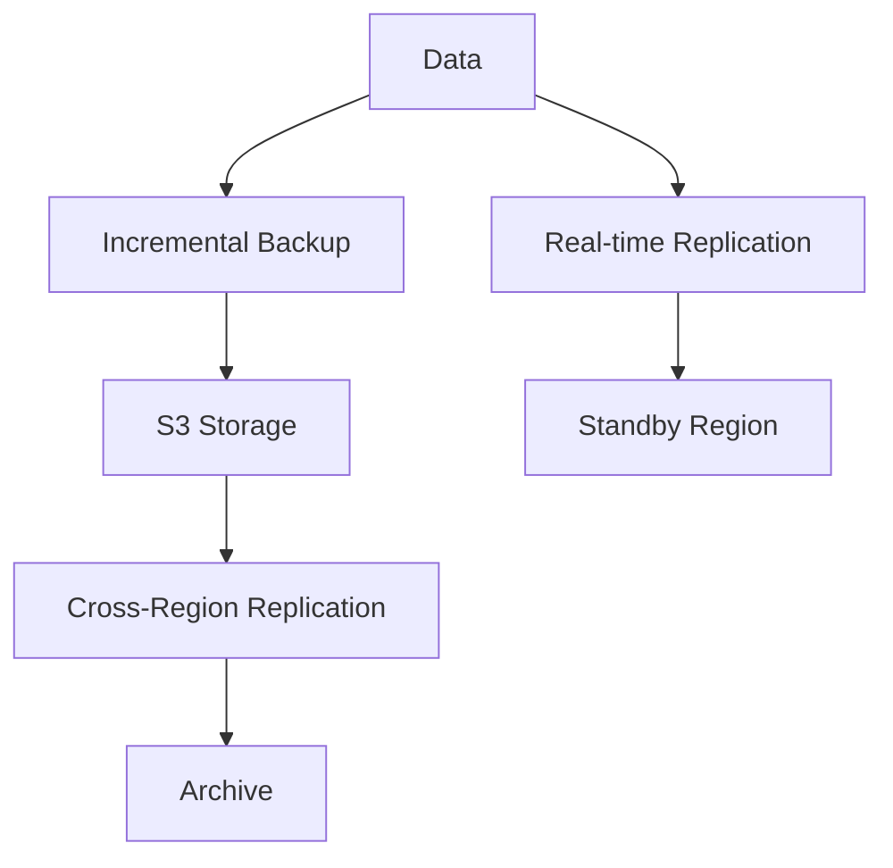
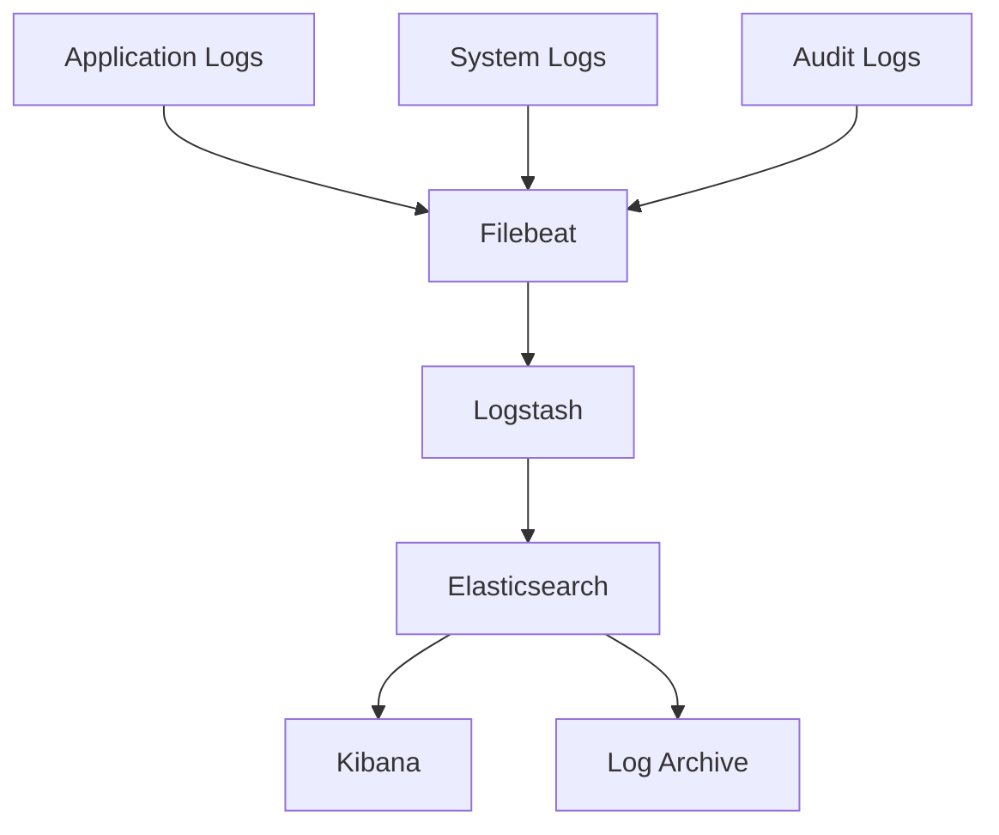
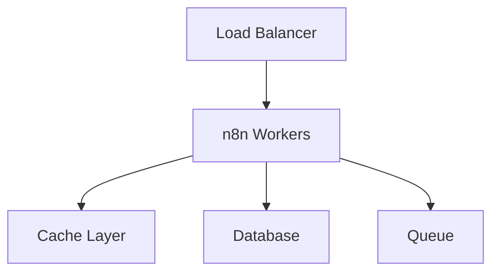

# Arquitetura 2024 - n8n Enterprise

## 🏗 Visão Geral da Arquitetura

### Camadas Principais

## 🔄 Componentes

### Frontend
- Next.js para SSR
- React para UI
- Redux para state management
- Material-UI para componentes
- PWA support

### API Gateway
- Kong Gateway
- Rate limiting
- Authentication
- SSL termination
- Request transformation

### n8n Cluster
- Kubernetes orchestration
- Horizontal scaling
- Service mesh (Istio)
- Circuit breakers
- Load balancing

### Cache Layer
- Redis Cluster
- Cache invalidation
- Session storage
- Rate limiting
- Real-time features

### Database
- PostgreSQL cluster
- Sharding
- Read replicas
- Automated backups
- Point-in-time recovery

### Storage
- S3-compatible
- Multi-region
- Versioning
- Lifecycle policies
- Encryption at rest

### Message Queue
- Apache Kafka
- Event streaming
- Dead letter queues
- Message persistence
- Stream processing

## 🔒 Segurança

### Authentication & Authorization

### Data Protection
- Encryption em trânsito (TLS 1.3)
- Encryption em repouso (AES-256)
- Key management (HashiCorp Vault)
- Data masking
- Audit logging

## 📊 Monitoramento

### Observability Stack

### Métricas Coletadas
- Application metrics
- Business metrics
- Infrastructure metrics
- Security metrics
- Cost metrics

## 🔄 CI/CD Pipeline

### Workflow

### Features
- Automated testing
- Security scanning
- Performance testing
- Canary deployments
- Automated rollbacks

## 💾 Backup & Recovery

### Strategy

### Features
- Point-in-time recovery
- Cross-region replication
- Automated verification
- Compliance archiving
- Disaster recovery

## 🔍 Logging & Auditoria

### Log Management

### Features
- Structured logging
- Log aggregation
- Real-time analysis
- Compliance reporting
- Log retention

## 🚀 Escalabilidade

### Horizontal Scaling

### Features
- Auto-scaling
- Load distribution
- Resource optimization
- Performance monitoring
- Capacity planning

## 📈 Performance

### Otimizações
- CDN integration
- Query optimization
- Cache strategies
- Connection pooling
- Resource compression

### Métricas
- Response time
- Throughput
- Error rates
- Resource utilization
- Business metrics

## 🔗 Integrações

### Sistema de Plugins
- Plugin marketplace
- Versioning
- Security scanning
- Documentation
- Testing framework

### API Management
- API versioning
- Documentation
- Rate limiting
- Analytics
- Developer portal 