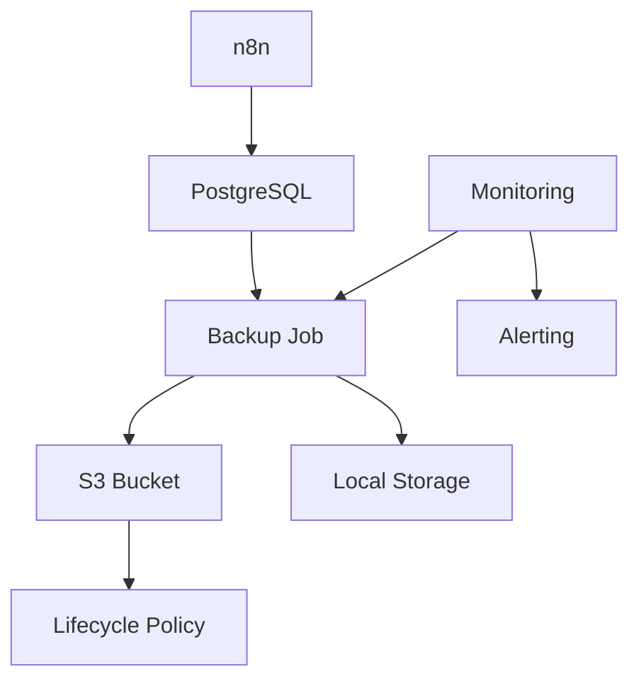

# Guia de Backup - n8n Enterprise

## Visão Geral
Este guia detalha a estratégia de backup e recuperação implementada no ambiente n8n Enterprise.

## Arquitetura de Backup



## Componentes

### Backup Job
```yaml
schedule: "0 2 * * *"  # 2 AM diariamente
retention:
  daily: 7 days
  weekly: 4 weeks
  monthly: 12 months
  yearly: 5 years

components:
  - database
  - workflows
  - credentials
  - variables
  - configurations
```

### Storage
```yaml
s3:
  bucket: n8n-backups
  region: us-east-1
  encryption: AES-256
  versioning: enabled
  
local:
  path: /backup
  retention: 7 days
  compression: gzip
```

## Tipos de Backup

### Full Backup
1. Componentes:
   - Banco de dados completo
   - Workflows
   - Credenciais
   - Variáveis
   - Configurações

2. Frequência:
   - Diário às 2h
   - Retenção de 7 dias

3. Processo:
   ```bash
   # Backup do banco
   pg_dump -Fc -f backup.dump
   
   # Backup de arquivos
   tar -czf files.tar.gz /data
   
   # Upload para S3
   aws s3 cp backup.dump s3://bucket/
   aws s3 cp files.tar.gz s3://bucket/
   ```

### Incremental Backup
1. Componentes:
   - WAL logs
   - Novos workflows
   - Alterações de config

2. Frequência:
   - A cada 6 horas
   - Retenção de 48 horas

3. Processo:
   ```bash
   # Backup WAL
   pg_basebackup -D backup
   
   # Sync de arquivos
   rsync -av /data/ backup/
   
   # Upload para S3
   aws s3 sync backup/ s3://bucket/
   ```

## Monitoramento

### Métricas
```yaml
backup_metrics:
  - status
  - duration
  - size
  - last_success
  - error_count
```

### Alertas
```yaml
alerts:
  backup_failed:
    condition: status != success
    severity: critical
    notification: immediate
    
  backup_late:
    condition: time_since_last > 26h
    severity: warning
    notification: oncall
    
  storage_low:
    condition: free_space < 20%
    severity: warning
    notification: team
```

## Recuperação

### Procedimento Completo
1. Preparação:
   ```bash
   # Parar serviços
   docker-compose down
   
   # Limpar diretórios
   rm -rf /data/*
   ```

2. Restauração:
   ```bash
   # Download do backup
   aws s3 cp s3://bucket/backup.dump .
   aws s3 cp s3://bucket/files.tar.gz .
   
   # Restaurar banco
   pg_restore -d n8n backup.dump
   
   # Restaurar arquivos
   tar -xzf files.tar.gz -C /
   ```

3. Validação:
   ```bash
   # Verificar integridade
   psql -c "SELECT count(*) FROM workflows"
   
   # Testar serviços
   docker-compose up -d
   curl http://localhost:5678/healthz
   ```

### Recuperação Pontual
1. Seleção do ponto:
   - Data/hora específica
   - Antes de incidente
   - Última versão estável

2. Processo:
   ```bash
   # Identificar backup
   aws s3 ls s3://bucket/
   
   # Download específico
   aws s3 cp s3://bucket/backup_20240101.dump .
   
   # Restauração seletiva
   pg_restore -t workflows -d n8n backup.dump
   ```

## Testes e Validação

### Testes Regulares
1. Mensal:
   - Restauração completa
   - Verificação de integridade
   - Teste de aplicação

2. Trimestral:
   - DR simulation
   - Tempo de recuperação
   - Procedimentos de emergência

### Checklist de Validação
```yaml
validations:
  - database_integrity
  - file_completeness
  - configuration_correctness
  - service_functionality
  - performance_metrics
```

## Segurança

### Criptografia
1. Em repouso:
   - AES-256 no S3
   - Encrypted volumes
   - Key management

2. Em trânsito:
   - TLS 1.3
   - VPN quando necessário
   - Certificados gerenciados

### Acesso
```yaml
permissions:
  backup_service:
    - s3:PutObject
    - s3:GetObject
    - s3:ListBucket
    
  restore_service:
    - s3:GetObject
    - s3:ListBucket
    
  monitoring:
    - s3:ListBucket
    - s3:GetMetrics
```

## Manutenção

### Rotinas
1. Diárias:
   - Verificar status
   - Validar integridade
   - Limpar temporários

2. Semanais:
   - Análise de espaço
   - Teste de restauração
   - Revisão de logs

3. Mensais:
   - Teste completo
   - Atualização de docs
   - Review de política

## Referências
- [PostgreSQL Backup](https://www.postgresql.org/docs/current/backup.html)
- [AWS S3 Best Practices](https://docs.aws.amazon.com/AmazonS3/latest/userguide/security-best-practices.html)
- [n8n Data Management](https://docs.n8n.io/hosting/data-management/)
- [Disaster Recovery Best Practices](https://cloud.google.com/architecture/dr-scenarios-planning-guide) 