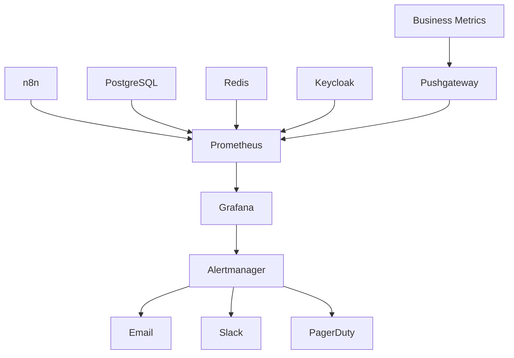

# Guia de Monitoramento - n8n Enterprise

## Visão Geral
Este guia detalha a estratégia de monitoramento implementada no ambiente n8n Enterprise.

## Arquitetura de Monitoramento



## Métricas Coletadas

### Sistema
```yaml
system_metrics:
  - cpu_usage
  - memory_usage
  - disk_usage
  - network_io
  - process_count
```

### Aplicação
```yaml
n8n_metrics:
  - workflow_executions
  - execution_time
  - error_rate
  - active_workflows
  - webhook_calls
```

### Banco de Dados
```yaml
postgres_metrics:
  - connections
  - transactions
  - query_time
  - table_size
  - index_usage
```

### Cache
```yaml
redis_metrics:
  - hit_rate
  - memory_usage
  - connected_clients
  - commands_processed
  - evicted_keys
```

## Dashboards

### Overview
- Status geral do sistema
- Métricas principais
- Alertas ativos
- Tendências

### Performance
- Latência
- Throughput
- Recursos
- Bottlenecks

### Workflows
- Execuções
- Erros
- Duração
- Success rate

### Business
- KPIs
- ROI
- Tendências
- Previsões

## Alertas

### Configuração
```yaml
alerts:
  high_cpu:
    threshold: 80%
    duration: 5m
    severity: warning
  
  high_memory:
    threshold: 85%
    duration: 5m
    severity: warning
  
  error_rate:
    threshold: 5%
    duration: 15m
    severity: critical
  
  disk_space:
    threshold: 90%
    duration: 1h
    severity: warning
```

### Severidade
1. Critical
   - Sistema indisponível
   - Perda de dados
   - Violação de segurança

2. Warning
   - Performance degradada
   - Erros não críticos
   - Recursos limitados

3. Info
   - Eventos normais
   - Manutenção
   - Updates

### Notificações
```yaml
channels:
  email:
    to: team@empresa.com
    from: monitoring@empresa.com
    
  slack:
    channel: #monitoring
    mentions: @oncall
    
  pagerduty:
    service_key: XXX
    escalation_policy: standard
```

## Business Metrics

### Coleta
1. Workflow Value:
   - ROI por workflow
   - Tempo economizado
   - Recursos otimizados

2. User Activity:
   - Usuários ativos
   - Workflows criados
   - Execuções por usuário

3. Integration Health:
   - Disponibilidade
   - Taxa de sucesso
   - Tempo de resposta

### Visualização
```yaml
dashboards:
  business:
    - name: "Business Value"
      metrics:
        - total_value_generated
        - cost_savings
        - efficiency_gains
    
    - name: "User Engagement"
      metrics:
        - active_users
        - workflow_creation_rate
        - user_satisfaction
    
    - name: "Integration Performance"
      metrics:
        - integration_uptime
        - response_times
        - error_rates
```

## Logs

### Estrutura
```yaml
log_format:
  timestamp: ISO8601
  level: string
  service: string
  message: string
  metadata:
    user: string
    workflow: string
    execution_id: string
    error: object
```

### Retenção
```yaml
retention_policy:
  error_logs: 90 days
  audit_logs: 365 days
  performance_logs: 30 days
  system_logs: 60 days
```

## Performance Monitoring

### APM
1. Traces:
   - Request flow
   - Database queries
   - External calls

2. Profiling:
   - CPU usage
   - Memory allocation
   - I/O operations

3. Error Tracking:
   - Stack traces
   - Error context
   - Impact analysis

### Capacity Planning
```yaml
thresholds:
  cpu_warning: 70%
  cpu_critical: 85%
  memory_warning: 75%
  memory_critical: 90%
  disk_warning: 80%
  disk_critical: 90%
```

## Manutenção

### Rotinas
1. Diárias:
   - Verificar alertas
   - Validar backups
   - Checar logs

2. Semanais:
   - Análise de tendências
   - Ajuste de thresholds
   - Limpeza de dados

3. Mensais:
   - Revisão de dashboards
   - Otimização de queries
   - Relatórios gerenciais

### Troubleshooting
1. Coleta de dados:
   - Logs relevantes
   - Métricas específicas
   - Estado do sistema

2. Análise:
   - Correlação de eventos
   - Identificação de causa raiz
   - Impacto assessment

3. Resolução:
   - Ações corretivas
   - Validação
   - Documentação

## Referências
- [Prometheus Docs](https://prometheus.io/docs/)
- [Grafana Best Practices](https://grafana.com/docs/grafana/latest/best-practices/)
- [APM Methodology](https://www.elastic.co/guide/en/apm/guide/current/index.html)
- [SRE Book](https://sre.google/sre-book/monitoring-distributed-systems/) 